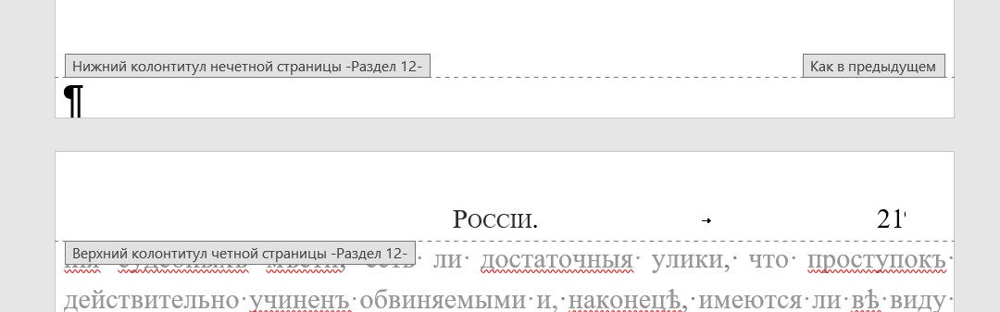
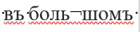
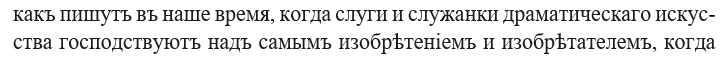
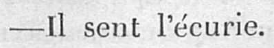

# Как править текст

Основная задача – как можно точнее отразить в вордовском документе то, что содержится в pdf-файле.

## Софт, который потребуется:

1. MS Word (или любой другой текстовый редактор с поддержкой docx формата)
2. Любой PDF-редактор (править в pdf-файле ничего не придется, только открыть) 

### 1. Настраиваем MS Word (или другой текстовый редактор)

1. Задаем горячие клавиши для специфических символов ( **ѣ**, **ъ**, **і**).

    Открываем вкладку **Вставка – Символ – Другие символы – Символы** (набор «Кириллица»), в поле выбираем нужный символ и задаем сочетание клавиш. Можно сделать-то что-то вроде `Ctrl+Shift+ъ` для **ѣ** и `Ctrl+Shift+и` для **i**.

2. Включаем отображение служебных символов 

3. Отключаем проверку орфографии (для старой орфографии нет словаря, поэтому красные подчеркивания будут лишь затруднять чтение).
   
   Находим на верхней панели кнопку **Настроить панель быстрого доступа**, убираем галочку из пункта **Правописание**.
   
4. Открываем одновременно вордовский документ и pdf-файл. Удобнее, если экран монитора разделен на две половины – так гораздо легче увидеть расхождения.

### 2. Правим ошибки. Важно делать это максимально аккуратно – в соответствии с pdf-файлом. Если в pdf-файле очевидная опечатка – то нужно сохранить ее и в вордовском документе.

- Номера страниц содержатся в колонтитулах вместе с названием раздела/секции. Если номер отсутствует в вордовскойм документе, но он есть в pdf-файле - проставьте его самостоятельно. Чтобы отредактировать текст в колонтитуле, щелкните по области два раза левой кнопкой мыши и исправьте опечатки.

- Знаки переноса исправлять не требуется:
    

     
Убирать переносы нужно только если они превращаются в дефисы. Например, как здесь:

  
  
- Формат сносок по возможности лучше не редактировать. Исправлять только опечатки.
- Если встречаются абзацы/слова на иностранном – важно сохранять диакритику (надстрочные, подстрочные, внутристрочные знаки).
	Например, во французском это могут быть символы
	 
 > èéâê
        
в немецком
        
> öüäß
        

	
- Если в pdf-файле встречаются фрагменты, которые невозможно прочесть, лучше оставить соответствующее место в вордовском документе без изменений и продолжить работу с фрагментом, который понятен.
- Если в pdf-файле встречаются абзацы/фразы/предложения, которых нет в вордовском документе, нужно перепечатать недостающий фрагмент (с максимально возможным сохранением форматирования).